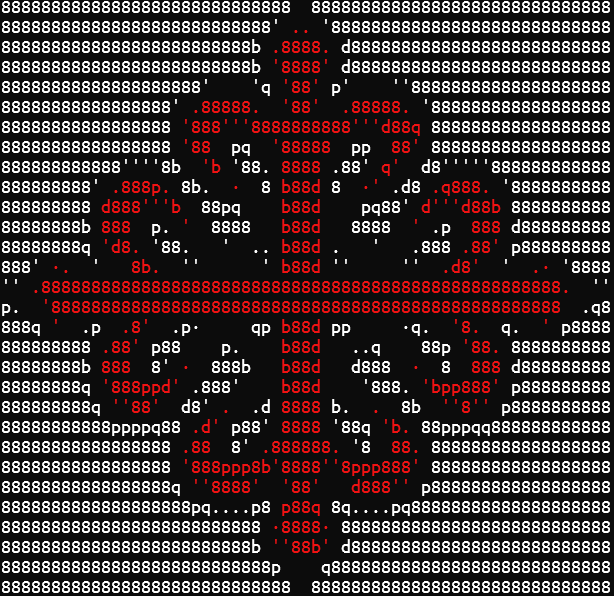
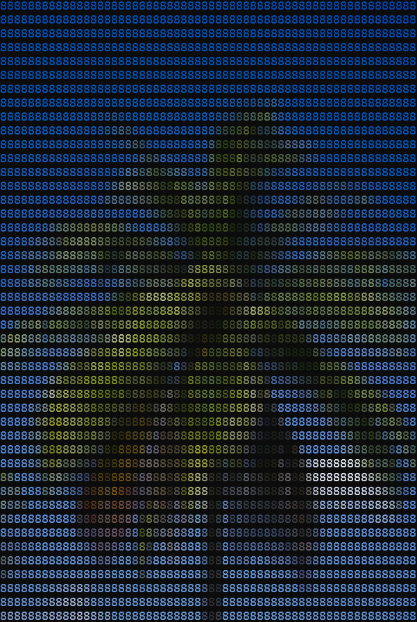

# Tutorial

This tutorial will guide you through the basic workflow of converting images to ASCII art while exploring a few options. We'll start with simple logos and progress to more complex examples.

## Table of Contents

- [Tutorial](#tutorial)
  - [Table of Contents](#table-of-contents)
  - [Simple Logo](#simple-logo)
  - [Colored Logo](#colored-logo)
  - [Printing Colors](#printing-colors)
  - [Putting It All Together](#putting-it-all-together)
  - [Images with a lot of details.](#images-with-a-lot-of-details)
  - [Other](#other)

## Simple Logo

The basic case consists of treating single-color logos. We will use the following image:


To convert it, we run the program from the console. The first argument must be the image path.

```bash
l2a Cross_Calatrava.png
```


-   To print the image in negative we add `-n` for `--negative`.

```bash
l2a Cross_Calatrava.png -n
```


-   In case the default character set is not enough:

There are many ways to change the characters used to transform the image, all of them explained in the [characters tutorial](tutorial/tutorial-characters).

In this case we will use all the printable ASCII characters by using a prebuilt dict.

```bash
l2a Cross_Calatrava.png -d all
```


-   It is also possible to change the size of the image. See the [size and position tutorial](tutorial/tutorial-size-position.md) for more.

For the moment lets use `-w`, which sets the width in characters the end result will have.

```bash
l2a Cross_Calatrava.png -w 100
```

This image is 100 characters wide.


-   Sometimes the image will not line up perfectly with the characters we have.

For alignment issues we can add padding or use `--center`. See the [size and position tutorial](tutorial/tutorial-size-position.md) for a deeper explanation.

Here we apply a padding in the x-axis and y-axis of half a block, so the points looks pointier (you can get information about the block size and more using `--verbose`, check out [this section](#other)).

```bash
l2a .\images\Cross_Calatrava.png --padx 4 --pady 8
```


## Colored Logo

Now let's try with a colored logo:


If we just used the app it would probably look horrible, so lets skip to the good part.

-   To draw borders between colors, use `-b, --borders all`. This detects color and brightness changes and draws black borders.

> [!Warning]
> Here we use `--borders all` instead of `--borders color` because the background color is transparent. Because of [how this app works](how-it-works.md), the transparent pixels are transformed into black, which shares the same hue as red, so just checking for color will not detect the border between the red tentacle and the background.

```bash
l2a '.\images\tentacles.png' -b all
```


-   Combine with `-n` and `-v` (for `--visible`, which makes transparent pixels white) to show only the borders.

```bash
l2a '.\images\tentacles.png' --borders all -nv
```


The other combinations of `-n` and `-v` are also interesting, you should always try them.

You can further customize the borders in the [border tutorial](tutorial/tutorial-borders.md)

## Printing Colors

-   To print the image with colors, use the argument `-c, --print-color`.

```bash
l2a .\images\Cross_Calatrava.png -c
```


```bash
l2a .\images\tentacles.png -b all -c
```


## Putting It All Together

You can combine multiple options for more complex results:

```bash
l2a .\images\Cross_Calatrava.png -cvb all -X1
```



## Images with a lot of details.

It is not recommended to convert an image with a lot of details. However, you can "trick" the algorithm by setting the midpoint brightness to 0, so the brightest character is always used and then print the colors.

```bash
l2a palm.jpg -c -m 0 --center --chars "8"
```



## Other

Other important arguments are:

-   `--verbose`: Will give you information about the characters used and the image.

An example of this is:

```txt
Characters:  .·'qpbd8
Char size: 8x16, Line gap: 0
Block size: 8x16
Original dimensions 1920x1600
Image dimensions: 640x533
Number of characters: 80x34
Unfilled space: 0x11 pixels
```

-   `-o, --output <OUTPUT>`: Saves the image after all the transformations.
-   `--alg <ALGORITHM>`: Changes how a character is chosen for a block. Find more in the [algorithm tutorial](tutorial/tutorial-algorithms.md)

Other important tutorials:

-   To adapt the result to your specific font you should check out the [font tutorial](tutorial/tutorial-font.md)
-   In the [preprocessing tutorial](tutorial/tutorial-preprocessing.md) you will learn more transformations this app can do to the image before converting it.
