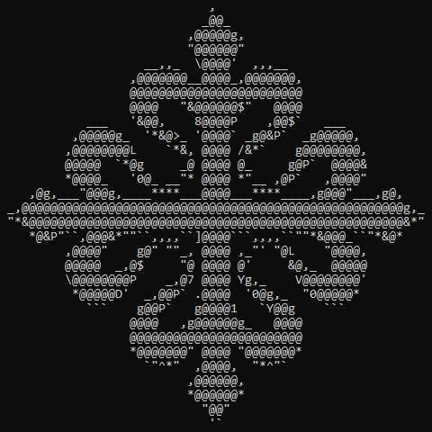
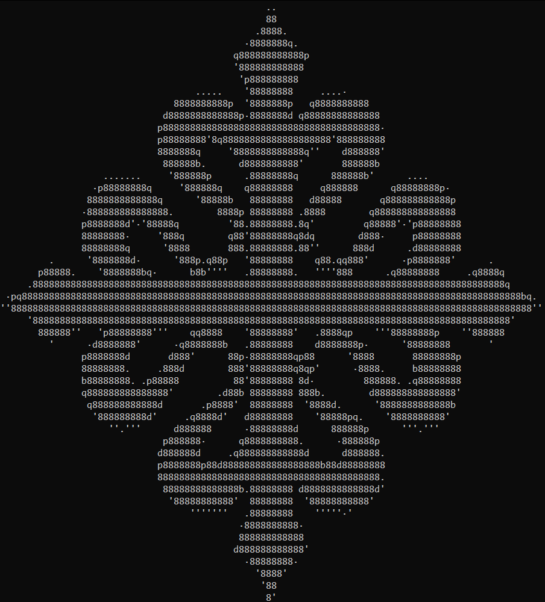
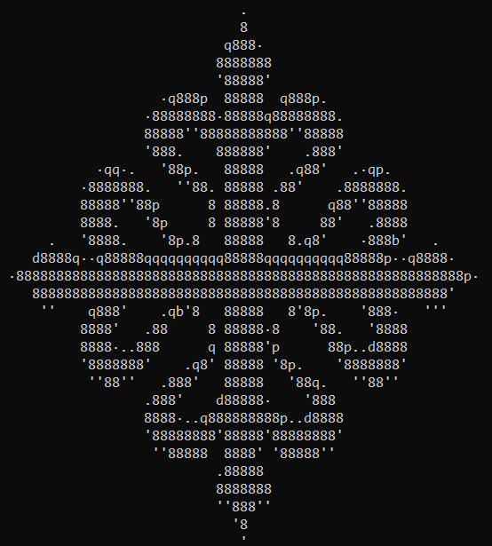
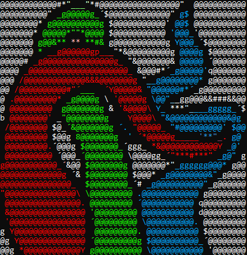

# Tutorial

This tutorial will guide you through the basic workflow of converting images to ASCII art. We'll start with simple logos and progress to more complex examples.

## Table of Contents

- [Tutorial](#tutorial)
  - [Table of Contents](#table-of-contents)
  - [Simple Logo](#simple-logo)
  - [Colored Logo](#colored-logo)
  - [Printing Colors](#printing-colors)
  - [Putting It All Together](#putting-it-all-together)
  - [Next Steps](#next-steps)

## Simple Logo

The basic case consists of treating single-color logos. We will use the following image:


To convert it, we run the program from the console. The first argument must be the image path.

```bash
lta Cross_Calatrava.png
```


- To print the image in negative, you must add `-n` to the command.

> [!IMPORTANT]
> Transparent pixels are never printed. In this case, the image has a transparent background, so we have to add `-v` to print them.

```bash
lta Cross_Calatrava.png -nv
```


The default character set is `8dbqp '·.` (including the space).

- To change the character set, use the argument `--chars <characters>`. The character set must be enclosed in `"` or `'` if you want to include the space.
- To add characters to the default group, use `-a <characters_to_add>`. For example, `-a "_/\\"` will add the characters `_`, `/`, and `\`.
- To use all printable ASCII characters, add `--all`.
- To remove characters, use `-x <characters_to_remove>`.

```bash
lta Cross_Calatrava.png --all
```



- To change the image size, use `-w <width>` and `-h <height>` for character dimensions, or `--wp <width>` and `--hp <height>` for pixel dimensions. If you change only one dimension, the aspect ratio is maintained.

```bash
lta Cross_Calatrava.png -w100
```



- For alignment issues, use offset arguments `--ofx <offset_x>` and `--ofy <offset_y>`.

```bash
l2a .\images\Cross_Calatrava.png --ofx 4 --ofy 8
```



## Colored Logo

Now let's try with a multi-color logo:


- To draw borders between colors, use `--borders color`. This detects color changes and draws black borders.

```bash
l2a '.\images\tentacles.png' --borders color
```


- Combine with `-n` for negative, or `-v` to show transparent pixels.

```bash
l2a '.\images\tentacles.png' --borders color -n
```


- To convert to black and white, add `--bw` and optionally `-t <threshold>`.

## Printing Colors

- To print with colors, use the argument `-C`.
- Adding `-s` saturates each pixel to the maximum.

```bash
l2a .\images\Cross_Calatrava.png -C
```


```bash
l2a .\images\tentacles.png -cC
```


## Putting It All Together

You can combine multiple options for more complex results:

```bash
l2a .\images\Cross_Calatrava.png -cCv
```


```bash
l2a .\images\tentacles.png -cCv -a "@#$&Yg*'´_/\ \""
```



- To save the processed image before conversion, use `-o <filename>`.

```bash
l2a .\images\tentacles.png -cCv -o final_tentacles_cCv.png
```

## Next Steps

- [Learn about different algorithms](tutorial/tutorial-algorithms.md) for character matching
- [Explore advanced techniques](tutorial/tutorial-advanced.md) and combinations
- [Tips for different types of images](tutorial/tutorial-images.md)
- [Full usage reference](../usage.md)