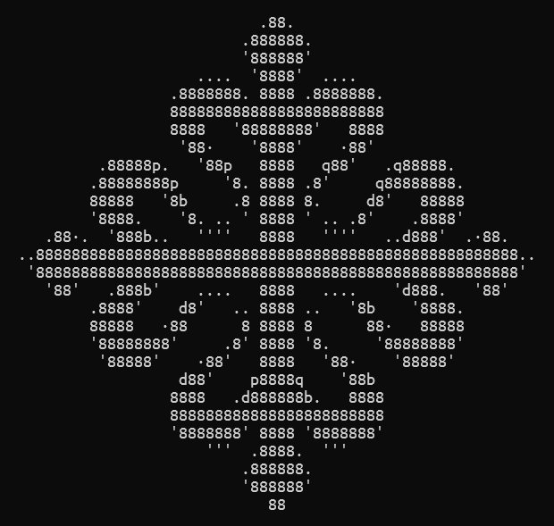
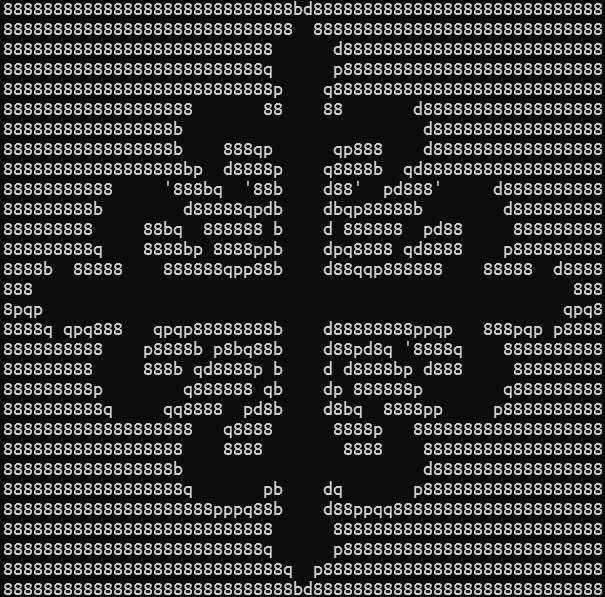
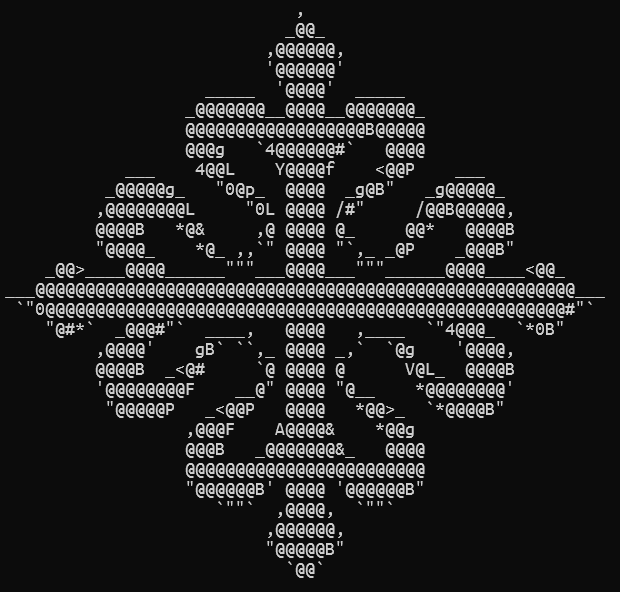
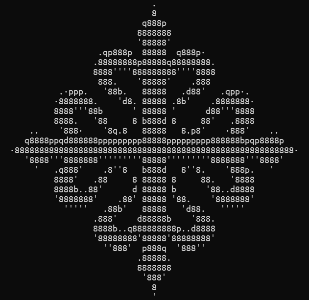
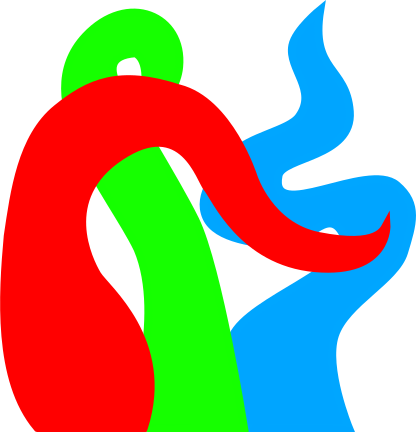
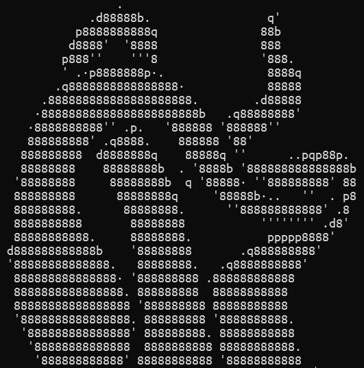
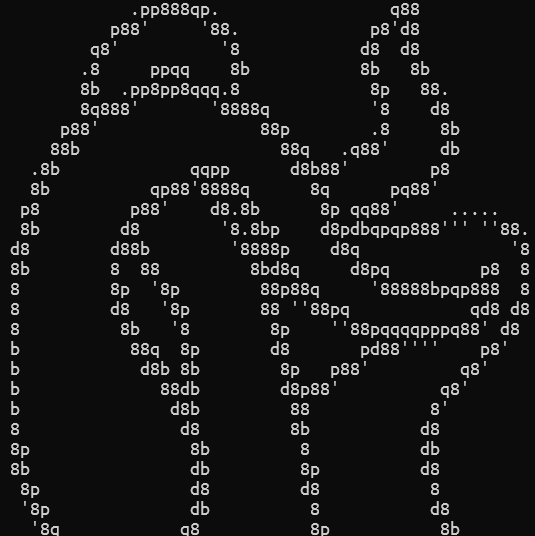
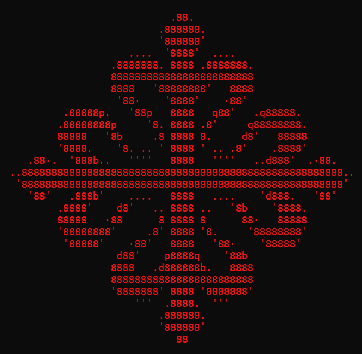
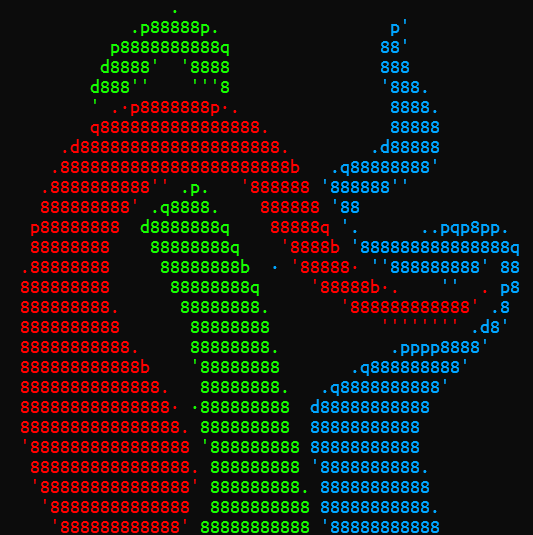

# Tutorial

This tutorial will guide you through the basic workflow of converting images to ASCII art. We'll start with simple logos and progress to more complex examples.

## Table of Contents

- [Tutorial](#tutorial)
  - [Table of Contents](#table-of-contents)
  - [Simple Logo](#simple-logo)
  - [Colored Logo](#colored-logo)
  - [Printing Colors](#printing-colors)
  - [Putting It All Together](#putting-it-all-together)
  - [Other](#other)

## Simple Logo

The basic case consists of treating single-color logos. We will use the following image:


To convert it, we run the program from the console. The first argument must be the image path.

```bash
l2a Cross_Calatrava.png
```



-   To print the image in negative, `-n` must be added to the command.

```bash
l2a Cross_Calatrava.png -n
```



-   In case the default set of characters is not enough.

There are many ways to change the characters used to transform the image, all of them explained in the [characters tutorial](tutorial/tutorial-characters).

However, the simplest one is to use a prebuilt character set. For example, here we use all the printable ASCII characters, although there are more.

```bash
l2a Cross_Calatrava.png -d all
```



-   It is also possible to change the size of the image. See the [size and position tutorial](tutorial/tutorial-size-position.md) for more.

In this case we use the argument `-w`, which sets the width in characters the end result will have.

```bash
l2a Cross_Calatrava.png -w 100
```


-   Sometimes the image will not line up perfectly with the characters we have.

For alignment issues we can add padding or center the image. See the [size and position tutorial](tutorial/tutorial-size-position.md) for a deeper explanation.

Here we apply a padding in the x-axis and y-axis of half a character (you can find this out in [other](#other)).

```bash
l2a .\images\Cross_Calatrava.png --ofx 4 --ofy 8
```



## Colored Logo

Now let's try with a multi-color logo:



-   To draw borders between colors, use `--borders all`. This detects color and brightness changes and draws black borders.
-   The thickness of the border can be changed with `-k, --thickness` and it is measured in pixels.

> [!Warning]
> Here we use `--borders all` instead of `--borders color` because the background color is transparent. Because of [how this app works](how-it-works.md), the transparent pixels are transformed into black, which shares the same hue as red, so just checking for color will not detect the border between the red tentacle and the background.

```bash
l2a '.\images\tentacles.png' -b all
```



-   Combine with `-n` for negative, or `-v` to show only the borders.

```bash
l2a '.\images\tentacles.png' --borders all -nv
```



The other combinations of `-n` and `-v` are also interesting, you should always try them.

You can further customize the borders in the [border tutorial](tutorial/tutorial-borders.md)

## Printing Colors

-   To print the image with colors, use the argument `-c`.

```bash
l2a .\images\Cross_Calatrava.png -c
```



```bash
l2a .\images\tentacles.png -b all -c
```



## Putting It All Together

You can combine multiple options for more complex results:

```bash
l2a .\images\Cross_Calatrava.png -cvb all
```


## Other

Other important arguments are:

-   `--verbose`, which will give you information about the characters used and the image.
-   `-o <file_name>` Because of [how this app works](how-it-works.md), the image you give it will be modified. This arguments lets you save it.
-   `--alg` changes how a character is chosen for a block. Find more in the [algorithm tutorial](tutorial/tutorial-algorithms.md)
-   In the [preprocessing tutorial](tutorial/tutorial-preprocessing.md) you will learn more transformations this app can do.
