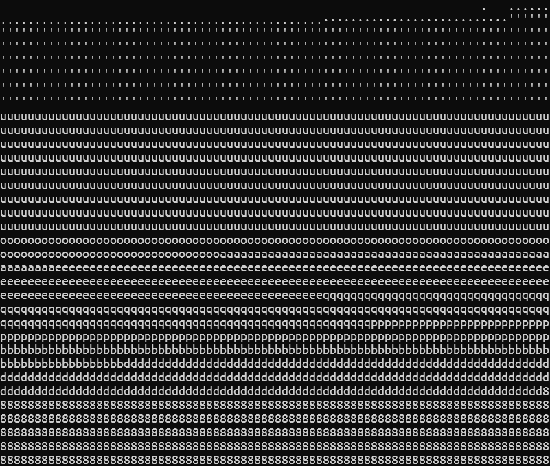
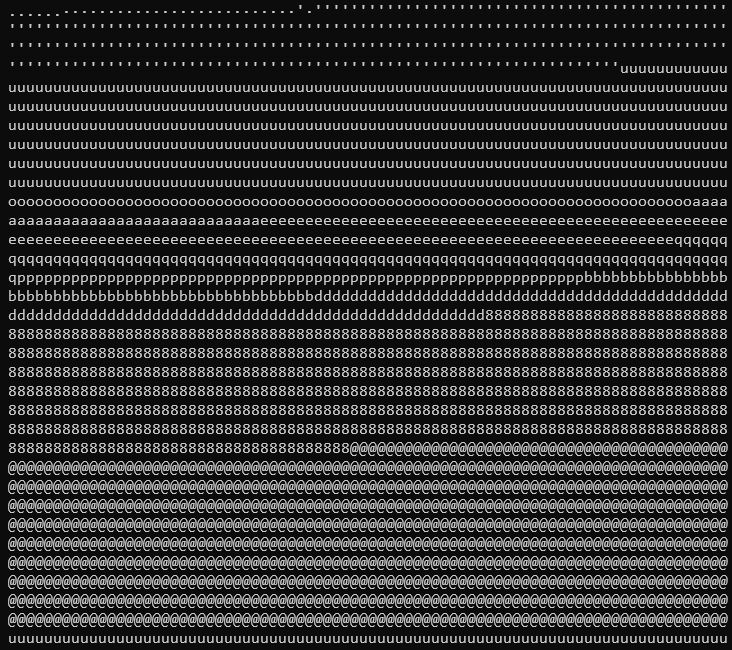

# Tutorial: Algorithms

In addition to the default algorithm (`max_prod`), Logo to ASCII supports several other algorithms for matching image blocks to characters. Each algorithm has different strengths and can produce varying results.

## Available Algorithms

-   `max_prod` (default)
-   `min_diff`
-   `min_diff_sq`
-   `gradient`
-   `corr`
-   `ncc`

## Algorithm Explanations

The `min_diff` and `min_diff_sq` algorithms operate pixel by pixel, producing results similar to `max_prod` but with less definition.

`corr` and `ncc` measure correlation and normalized cross-correlation respectively. These consider how similar the variations are between a block and a character, with `ncc` also accounting for magnitude differences.

The `gradient` algorithm calculates the average brightness of each block rather than comparing shapes. This is more like traditional ASCII art converters.

You can see a more technical explanation here [this](../how-it-works.md#other-algorithms) page.

## Gradient Algorithm Details

The `gradient` algorithm normalizes the brightness of the characters (the less bright character is a 0 and the brightest is a 1) but not the image's blocks.

This means adding or removing characters changes the ranges assigned to each character. For darker images, brighter characters may not appear.

To change this, the `-g, --grayscale` flag is used, which converts the image to grayscale and brightens it so the brightest point in the image becomes white.

## Examples

Using a gradient image to demonstrate:

(The `-v, --visible` flag is added to make the transparent pixels white, because the image doesn't fill perfectly the bottom part)

```bash
l2a .\images\gradient.jpg -w 80 --alg gradient --chars aeou -v
```



By adding an @ and removing the space, darker blocks use the next darker character and brighter blocks use brighter characters:

```bash
l2a .\images\gradient.jpg -w 80 --algo gradient -a ouae@ -x " " -v
```



## Choosing an Algorithm

-   Use `max_prod` for most logos and simple shapes (default)
-   Try `gradient` for photos or images with smooth gradients
-   Experiment with the other ones, but with little hope

For more algorithm details, see the [How It Works](../how-it-works.md) page.
