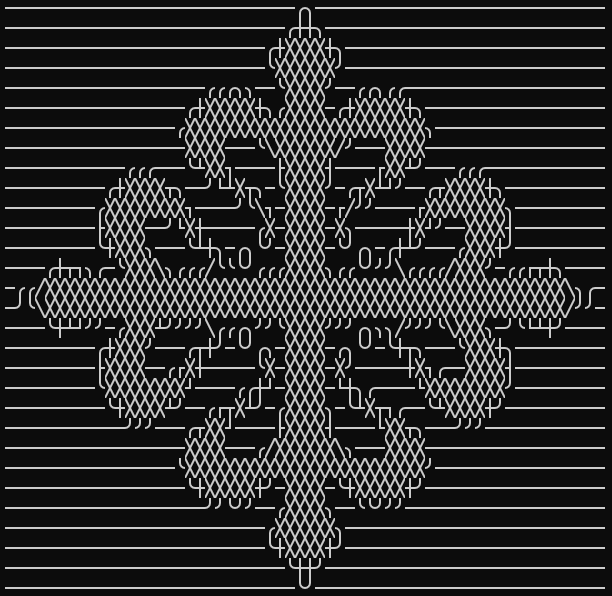
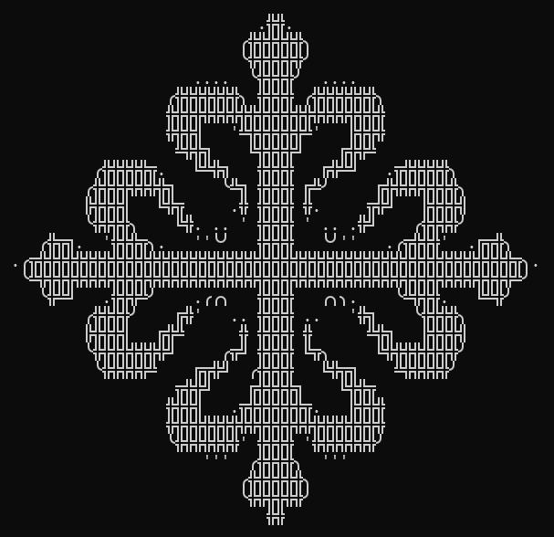
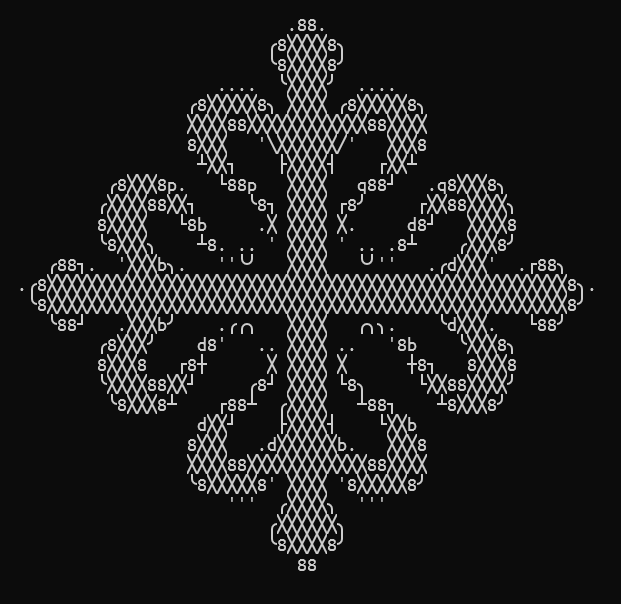

# Tutorial: Characters

In this tutorial we will go over how to change the characters used.

The default character set is `8dbqp'·. ` (including the space). It was chosen because the characters are symmetrical or have a mirrored one.

However, there are more interesting character sets.

## Customize the character set

-   To add characters use `-a, --add-chars <ADD_CHARS>`. For example, `-a "_/\\"` will add the characters `_`, `/`, and `\`.
-   To remove characters, use `-x, --except <EXCEPT>`.
-   To change the character set, use the argument `--chars <CHARS>`. The character set must be enclosed in `"` or `'` if you want to include the space.
-   You can also use prebuilt sets with the argument `-d, --dict <DICTS>`, explained in the next section.

## Use a prebuilt character set

With the option `-d, --dict <DICTS>` you can specify a different default character set. It will override the ones in `--chars`, but you can still use `-a, --add-chars` and `-x, --except` to customize it.

You can know which characters are in each dict with the `--verbose` option.

You can specify multiple sets by separating them with a comma, like `-d box_all,nerd`

The possible dicts are:

-   `default`: The default set, used only to mix with the other ones. `8dbqp'·. `
-   `all`: All ASCII printable characters, from 32 to 126. `.-',:_~";!^r+><=*?|\L/icl)(Tv7ztJsY1x{Inuf}][CFjo23ya5SVeZ4wPhmkXGE$69qpAKbdUOgHD8RMW0&#%QNB@` (`included)
-   `symbols`: A few symbols. ` .-':¡!+=@`
-   `blocks`: Blocks with different shades. ` ░▒▓█`
-   `blocks_all`: Blocks with different widths and heights, not all of them are printable with a normal font. ` ▏▕▁▔░▎▗▖▂▝▘▍▃▄▐▌▞▚▀▅▒▋▆▟▙▜▛▊▓▇▉█`
-   `box`: Characters used to draw boxes. `─┐┌┘└┬┴│├┤┼`
-   `box_all`: Extended version of box. `─╭╮╯╰┐┌┘└┬┴╲╱│├┤┼╳`
-   `box_double`: Same as box but with double lines. `═╗╔╝╚╦╩║╣╠╬`
-   `box_double_all`: Extended version of box_double. `╭╮╯╰╲╱═╗╔╝╚╦╩╳║╣╠╬`
-   `nerd` A few characters only available in nerd fonts. ` `
-   `math`: Math symbols. ` ÷×∞≈√∫≠±≥≤∑∆∂∏`
-   `numbers`: Only numbers. ` 7123546980`
-   `letters`: Only letters. ` rLiclTvztJsYxInufCFjoyaSVeZwPhmkXGEqpAKbdUOgHDRMWQNB`

## Examples

```bash
l2a Cross_Calatrava.png -d box_all
```



```bash
l2a Cross_Calatrava.png -d box_double_all -a " .-'"
```



```bash
l2a Cross_Calatrava.png -d box_all, default
```



## Related

Not all fonts are equal, you can see the [font tutorial](tutorial-font.md) to adapt your image to your workspace.
