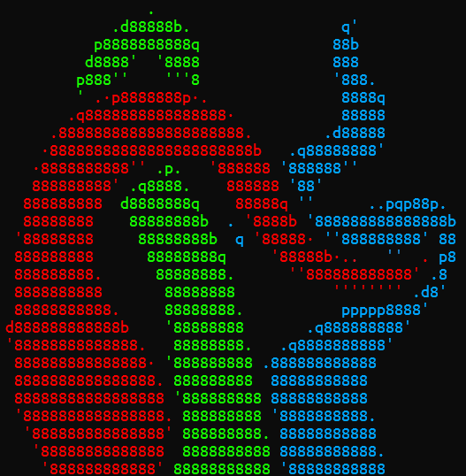
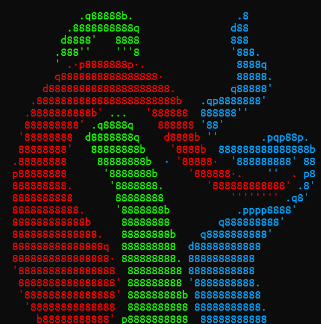

# Tutorial: Size and Position

It is weird that the image that you have fits perfectly where you want and how you want it, so we provide a set of tools that help with it.

## Adjusting size

There are multiple options to change the size of the final result:

-   `-w, --width-chars <WIDTH_IN_CHARS>`: Number of characters in the final image width.
-   `-h, --height-chars <HEIGHT_IN_CHARS>`: Number of characters in the final image height.
-   `-W, --width-pixels <WIDTH_IN_PIXELS>`: Width of the final image in pixels
-   `-H, --height-pixels <HEIGHT_IN_PIXELS>`: Height of the final image in pixels

Specifying size in characters overrides the size in pixels, and if you only change one dimension, the aspect ratio will be kept.

## Adjusting position

Sometimes the image is not in the position we want. To fix it we can change the padding.

-   `-C, --center`: Center the image in respect to the characters by adjusting the padding
-   `-P, --pad <PADDING>`: Padding on all sides [default: 0]
-   `-X, --padx <PADDING_X>`: Horizontal padding [default: 0]
-   `-Y, --pady <PADDING_Y>`: Vertical padding [default: 0]

The padding will be treated in the same way as a transparent color, and the padding you specify manually will be added to the one calculated on `--center`.

## Practical example

> ![Warning]
> This case takes place in a version where you could not detect border by transparency, but it is still useful, as it might happen with other images.

Let's revisit the example of the tentacles:


This image fills the characters perfectly, there is no need to center it, but when we render it we might notice a character that seems out of place on the left part of the photo:

```bash
l2a '.\images\tentacles.png' -b all -c
```



That letter `d` is sticking a bit too much.

Let's have a look behind the scenes by saving the final image.

```bash
l2a '.\images\tentacles.png' -b all -c -o test.png
```


The border of the red tentacle is touching the left border of the image, so no border is detected there. The same thing happens with the blue tentacle on the right border.

We can fix this by adding padding in the x axis.

```bash
l2a '.\images\tentacles.png' -b all -c --padx 1
```



The `d` has disappeared. Let's check the final image again.

```bash
l2a '.\images\tentacles.png' -b all -c --padx 1 -o test2.png
```


We can see that those borders have been detected because the image had more space.

However, if you look at the bottom there are still borders that have not been detected. Fixing it is left as an exercise to the reader.
