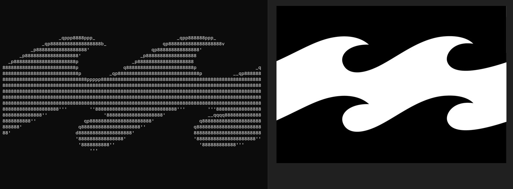
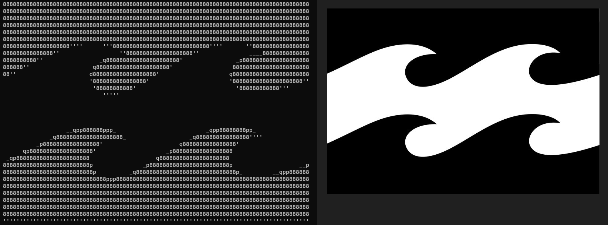

# Logo to ASCII

Prueba de concepto para convertir un logo en ASCII art (hecho en rust).

A diferencia de otros conversores de imágenes a ASCII, este no usa la luminosidad media de cada bloque, sino que elige el carácter que mejor se aproxima a su forma. No hace diferencia entre colores, solo mide la luminosidad que tiene cada píxel, por lo que funciona mejor con imágenes en blanco y negro con bordes definidos.


## Índice
- [Logo to ASCII](#logo-to-ascii)
  - [Índice](#índice)
  - [Instalación](#instalación)
  - [Uso](#uso)
  - [¿Cómo funciona?](#cómo-funciona)
  - [Preguntas frecuentes](#preguntas-frecuentes)

## Instalación

1. Descarga rust desde https://www.rust-lang.org/tools/installs:
   1. Al terminar la instalación escribe `rustc --version` en la consola para comprobar que todo ha salido bien.
2. Descarga este repositorio.
3. Compila el repositorio: En la consola de comandos ejecuta `cargo build`.

## Uso

1. Ejecuta el programa desde la consola. Le tenemos que indicar la imagen que queremos usar, por lo que el comando quedaría así:
   ```./target/debug/logo_to_ascii.exe --path <path_imagen>```

Ese comando imprimirá el texto en la consola. El set por defecto de caracteres es el `8dbqp'·. ` (incluyendo el espacio).

Opciones:
* Para imprimir la imagen en negativo (imprimiendo donde está el color negro) se debe añadir `-i` al comando.
* Para cambiar el set de caracteres se puede usar el argumento `--chars <caracteres>`. El set de caracteres debe ir entre `"` o `'` si se quiere usar el espacio. 
Para usar los caracteres de las comillas (`"` y `'`) se deben hacer pruebas dependiendo de la consola que se use.

<details>
<summary>Linux</summary>

* Se puede usar la barra invertida sin nungún problema: `--chars "chars'\""` usará `chars"'`.

</details>

<details>
<summary>Windows</summary>

* Powershell: `--chars "chars' \"` usará `chars' "`. Siempre tiene que haber un espacio antes de `\`. Si no, tomará `\` como carácter.
* CMD: `--chars "chars'\"` usará `chars'"`.

</details>
<br>

* Para añadir caracteres al grupo por defecto se puede usar `-a <caracteres_a_añadir>`.
* Para usar todos los caracters ASCII imprimibles por pantalla (del 32 al 126 incluidos) se debe añadir `--all`.

<!--  -->

* Para cambiar la fuente con la que se hace la comparación se puede usar el argumento `--font <path_fuente>.ttf`. Se tomará como fuente monoespacio de 8x16.
* Para guardar el texto en un documento de texto se puede añadir `> <path_archivo>.txt` al final del comando.


Logo a ASCII


Logo a ASCII en negativo

* **En beta:** Colores.
  * Para hacer una distición entre colores se puede añadir `-c` al comando. Esto imprimirá el carácter que mejor coincida con el hue más abundante en el bloque.
  * Es muy probable que el resultado no sea el esperado. Puede que mejore añadiendo `-n <número_de_colores>`. Este hará que diferentes hues cuenten como uno. El número indica cuántos bloques que se usarán para calcular el color más abundante. Para obtener el mejor resultado se recomienda probar con diferentes números.
  * !! Hay que tener en cuenta que las imágenes no suelen tener un cambio brusco de un color a otro, si no que tienen algunos píxeles intermedios. Esto puede hacer que el resultado no encaje a la perfección, sobre todo cuando no se usa el argumento -n.

## ¿Cómo funciona?

La idea surgió de un video en el que se convertía una imagen a ASCII. Sin embargo, se perdía mucha información, los caracteres no tenían la forma que debían.

Este algoritmo opera con píxeles en vez de con bloques.

Primero se procesan los caracteres. En la consola tienen una proporción de 2 de alto por 1 de ancho. Se eligen las dimensiones 8x16 para hacer un mapa de bits de cada carácter. Este indica la luminosidad de cada píxel.

Al calcular la luminosidad se obtiene un valor de 0 a 1. Es importante restarle 0.5 para obtener valores negativos y positivos.

Después se procesa la imagen, dividiéndola en bloques de 8x16 (la misma medida que nuestros caracteres) y se calcula la luminosidad de cada uno de los píxeles (restándole también 0.5). 

Por cada carácter, se multiplica el valor de cada píxel con su homólogo en el bloque, y se suman todos los valores ([0][0] * [0][0] + [0][1] * [0][1] + ...). Al final, se imprime el carácter con la puntuación más alta.

El algoritmo funciona porque al multiplicar dos valores positivos se obtiene un númro positivo, y al multiplicar dos números negativos también. Esto premia las coincidencias de píxeles (y no píxeles) y penaliza las diferencias.

## Preguntas frecuentes

* ¿Cómo imprimir un logo de color negro?
  Solo es un problema cuando el fondo es transparente. En ese caso basta con añadir `-i` al comando, para imprimir la imagen en negativo. Recordamos que el color transparente nunca se imprime.
