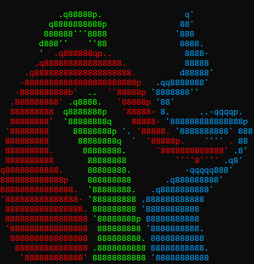

<div>


</div>

# Logo to ASCII

An application that converts a logo to ASCII art (made in Rust).

Unlike other image to ASCII converters, this one doesn't calculate the average brightness of each block (although it can), but chooses the character that best approximates its shape.

It works best with images of few colors and well-defined edges.

## Table of Contents

- [Logo to ASCII](#logo-to-ascii)
  - [Table of Contents](#table-of-contents)
  - [Installation](#installation)
    - [Downloads](#downloads)
    - [Clone the repo](#clone-the-repo)
  - [Basic Usage](#basic-usage)
  - [Documentation](#documentation)

## Installation

### Downloads

Pre-built binaries for Windows, Linux, and macOS are available on the [releases page](https://github.com/Jala3400/Logo_to_ASCII/releases).

### Clone the repo

-   Prerequisites: [Rust](https://www.rust-lang.org/tools/install), [Git](https://git-scm.com/downloads)

1. Clone the repository:

    ```bash
    git clone https://github.com/Jala3400/Logo_to_ASCII
    ```

2. Build:
    ```bash
    cargo build --release
    ```

## Basic Usage

```bash
l2a Cross_Calatrava.png
```

For more options, see the [Tutorial](docs/tutorial.md).

## Documentation

-   [Detailed Installation](docs/installation.md)
-   [Tutorial](docs/tutorial.md)
    -   [Algorithms](docs/tutorial/tutorial-algorithms.md)
    -   [Advanced Techniques](docs/tutorial/tutorial-advanced.md)
    -   [Working with Different Images](docs/tutorial/tutorial-images.md)
-   [Full Usage Reference](docs/usage.md)
-   [How It Works](docs/how-it-works.md)
-   [FAQ](docs/faq.md)
-   [help message](docs/help-message.md)
-   [Tips for Creating Images](docs/tips.md)
-   [Contributing](docs/contributing.md)
