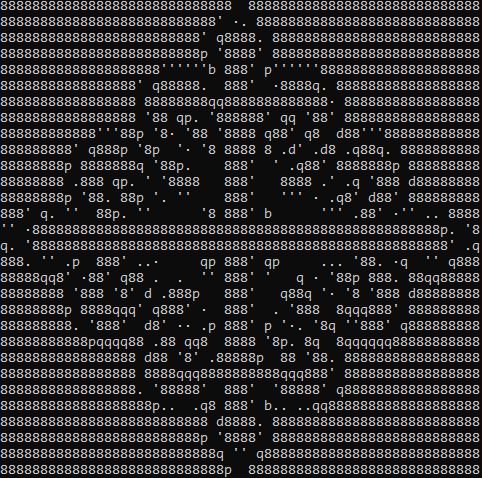
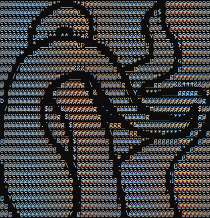

<div>
 
 
</div>

# Logo to ASCII

Prueba de concepto para convertir un logo en ASCII art (hecho en rust).

A diferencia de otros conversores de imágenes a ASCII, este no usa la luminosidad media de cada bloque, sino que elige el carácter que mejor se aproxima a su forma.

## Índice

- [Logo to ASCII](#logo-to-ascii)
  - [Índice](#índice)
  - [Instalación](#instalación)
  - [Tutorial](#tutorial)
    - [Logo simple](#logo-simple)
    - [Logo con colores](#logo-con-colores)
    - [Imagen con muchos detalles](#imagen-con-muchos-detalles)
  - [Consejos para crear imágenes](#consejos-para-crear-imágenes)
  - [¿Cómo funciona?](#cómo-funciona)
  - [Preguntas frecuentes](#preguntas-frecuentes)

## Instalación

1. Descarga rust desde https://www.rust-lang.org/tools/installs:
    1. Al terminar la instalación escribe `rustc --version` en la consola para comprobar que todo ha salido bien.
2. Descarga este repositorio.
3. Compila el repositorio: En la consola de comandos ejecuta `cargo build --release`.

## Tutorial

### Logo simple

El caso más básico consiste en tratar logos de un solo color. Usaremos la siguiente imagen:


Para convertirla, ejecutamos el programa desde la consola. Le indicamos la imagen con el argumento `--path <path_imagen>`.

`./target/release/logo_to_ascii.exe --path <path_imagen>`

```
./target/release/logo_to_ascii.exe --path ./images/Cross_Calatrava.png
```


**Opciones:**

-   Para imprimir la imagen en negativo (imprimiendo donde está el color negro) se debe añadir `-i` al comando.

> [!IMPORTANT]
> Los píxeles transparentes nunca se imprimen. En este caso, la imagen tiene el fondo transparente, por lo que tenemos que añadir `-v` para imprimirlos.

```
./target/release/logo_to_ascii.exe --path ./images/Cross_Calatrava.png -iv
```


El set por defecto de caracteres es `8dbqp'·. ` (incluyendo el espacio).

-   Para cambiar el set de caracteres se usa el argumento `--chars <caracteres>`. El set de caracteres debe ir entre `"` o `'` si se quiere usar el espacio.
    Para usar los caracteres de las comillas (`"` y `'`) se deben hacer pruebas dependiendo de la consola que se use:

<details>
<summary>Linux</summary>

-   Se puede usar la barra invertida sin ningún problema: `--chars "chars'\""` usará `chars"'`.

</details>

<details>
<summary>Windows</summary>

-   Powershell: `--chars "chars' \"` usará `chars' "`. Siempre tiene que haber un espacio antes de `\`. Si no, tomará `\` como carácter.
-   CMD: `--chars "chars'\"` usará `chars'"`.

</details>
<br>

-   Para añadir caracteres al grupo por defecto se usa `-a <caracteres_a_añadir>`. Por ejemplo, `-a "_/\\"` añadirá los caracteres `_`, `/` y `\`.
-   Para usar todos los caracteres ASCII imprimibles por pantalla (del 32 al 126 incluidos) se debe añadir `--all`.

```
./target/release/logo_to_ascii.exe --path ./images/Cross_Calatrava --all
```


-   En caso de que se quiera cambiar el tamaño de la imágen, se usarán los argumentos `-w <anchura>` y `-h <altura>`. Estos indicarán el número de caracteres que habrá en horizontal o en vertical en el texto final. **Si se cambia solo uno de los argumentos se mantendrá la proporción de la imágen.**
-   Además están las opciones `--aw <anchura>` y `--ah <altura>` que te permiten cambiar el tamaño de la imagen en píxeles. De la misma forma, si solo se indica un argumento, se mantendrá la proporción de la imágen.
    Estos argumentos se pueden mezclar, pero tendrá más prioridad el tamaño en caracteres.
    En la consola los caracteres tienen una proporción de 1x2. El tamaño que se usa en esta aplicación es de 8x16.

```
./target/release/logo_to_ascii.exe --path ./images/Cross_Calatrava.png -w100
```


-   Si la imagen no queda bien alineada con los caracteres, se puede usar el argumento offset `--ofx <offset_x>` y `--ofy <offset_y>`. Estos valores añaden un offset transparente a la imagen. Se puede ver mejor en las esquinas afiladas.

```
./target/release/logo_to_ascii.exe --path .\images\Cross_Calatrava.png --ofx 4 --ofy 8
```


-   Para cambiar la fuente con la que se hace la comparación se puede usar el argumento `--font <path_fuente>.ttf`.

> [!WARNING] > `--font` no adapta los bloques al tamaño de la fuente. Cada carácter se tomará como monoespacio de proporciones 1x2, lo que puede deformar el resultado final.

-   Para cambiar el punto medio de la luminosidad se usa `-m <punto_medio>`. Por defecto es 0.5. Se pone un valor más bajo se imprimirán colores más oscuros.
-   Para guardar el texto en un documento de texto se puede añadir `> <path_archivo>.txt` al final del comando.

### Logo con colores

Ahora vamos a probar con un logo de varios colores. Usaremos la siguiente imagen:


-   Para hacer una diferencia entre colores se usa el flag `-c`. Esto pondrá un borde negro donde detecte cambios de color. La anchura de los bordes se puede cambiar con el argumento `-b <anchura>`.

```
./target/release/Logo_to_ASCII.exe --path '.\images\tentacles.png' -c
```


-   Si se combina con `-i` y se tiene el fondo transparente solo se verán los bordes.

```
./target/release/Logo_to_ASCII.exe --path '.\images\tentacles.png' -ci
```


-   Para ver la imagen original en negativo, al igual que con el logo anterior, se debe añadir `-iv`

```
./target/release/Logo_to_ASCII.exe --path '.\images\tentacles.png' -civ
```


-   Otra combinación interesante es `-cv`

```
./target/release/Logo_to_ASCII.exe --path .\images\tentacles.png -cv
```


-   Todos estos argumentos también se puede usar con logos normales

```
./target/release/Logo_to_ASCII.exe --path .\images\Cross_Calatrava.png -cv
```



-   Y mezclar unos con otros

```
./target/release/Logo_to_ASCII.exe --path .\images\tentacles.png -cv -a "@#$&Yg*'´_/\ \"
```



-   Si se usa `-b <anchura>` sin `-c` se detectarán los bordes midiendo la luminosidad. No es recomendable, porque algunos colores (como el amarillo) tienen una luminosidad muy parecida a la del blanco, por lo que no se detecta la diferencia.
-   Para cambiar la sensibilidad del detector de bordes se usa `-d <diferencia>`. Cuanto más alto sea el valor, más brusco tendrá que ser el cambio para que se detecte.
-   Para pasar la imagen a blanco y negro se añade `-r`. Para cambiar el umbral se usa `-t <luminosidad_minima>`.

### Imagen con muchos detalles

Si estás pensando en pasar a ASCII una foto con muchos detalles, lo mejor es que dejes de hacerlo. Los caracteres ASCII no tienen suficiente detalle como para que se vea bien la foto. Lo mejor que se puede hacer es pasar la imagen a blanco y negro con `-r`.

Por ejemplo:


```
./target/release/Logo_to_ASCII.exe --path '.\images\palm.jpg' -r
```


## Consejos para crear imágenes

Se recomienda hacer dibujos vectoriales (.svg) y luego pasarlos a imagen.

Para obtener los mejores resultados es recomendable que las imágenes tengan bordes bien definidos y pocos detalles, así como superficies amplias.
Para facilitar el diseño se pueden hacer dibujos vectoriales con una rejilla de 8x16 y asegurarse de que los bordes del dibujo siempre coincidan con los bordes y esquinas de un bloque.

No se recomienda tener detalles más pequeños que uno de estos bloques.

## ¿Cómo funciona?

La idea surgió de un video en el que se convertía una imagen a ASCII. Sin embargo, se perdía mucha información y los caracteres no tenían la forma que debían.

Este algoritmo opera con píxeles en vez de con bloques.

1. **Caracteres:**

Primero se procesan los caracteres. En la consola tienen una proporción de 2 de alto por 1 de ancho. Una vez elegida una anchura (por defecto 8x16) se hace un mapa de bits de cada carácter, que indica la luminosidad de cada píxel.

Al calcular la luminosidad se obtiene un valor de 0 a 1. Es importante restarle 0.5 para obtener valores negativos y positivos.

Además, se cuentan el número de píxeles con luminosidad positiva para una optimización futura.

2. **Preprocesado (si lo hay)**

Primero se detectan los bordes: un píxel se marca como borde si la diferencia entre su valor y el de los píxeles situados a su derecha y debajo es más grande que un valor preestablecido. Estos bordes se pintan en la imagen.

Luego se cambia el tamaño de la imagen a las dimensiones deseadas.

3. **Bitmap de la imagen**

Al igual que con los caracteres, se mide la luminosidad de cada píxel de la imagen. Luego también se le resta 0.5 (a menos que se haya cambiado con `-m <punto_medio>`) para obtener valores negativos.

En caso de que se haya seleccionado la opción de pasar a blanco y negro, se pasará la imagen a blanco y negro antes de hacer el bitmap.

En esta fase también se añade el offset directamente en el bitmap.

4. **Convertir bloques a carácter**

Después se divide la imagen en bloques con las mismas medidas que los caracteres. Cada bloque se compara con todos los caracteres (se pueden saltar varios en ciertos casos, ver optimización).

Por cada carácter, se multiplica el valor de cada píxel con su homólogo en el bloque, y se suman todos los valores ([0][0] * [0][0] + [0][1] * [0][1] + ...). Al final, se imprime el carácter con la puntuación más alta.

**Optimización:**

En este paso también se cuentan el número de píxeles iluminados del bloque. Un carácter solo se considera para impresión si la mitad de sus píxeles con luminosidad positiva son al menos el número de los píxeles iluminados del bloque.

Además, si todos los píxeles están completamente iluminados se puede imprimir directamente el carácter más luminoso.

El algoritmo funciona porque al multiplicar dos valores positivos se obtiene un número positivo, y al multiplicar dos números negativos también. Esto premia las coincidencias de píxeles (y no píxeles) y penaliza las diferencias.

## Preguntas frecuentes

-   **¿Cómo imprimir un logo de color negro?**
    Solo es un problema cuando el fondo es transparente. En ese caso basta con añadir `-i` al comando, para imprimir la imagen en negativo. Recordamos que el color transparente nunca se imprime.

-   **¿Por qué cuando paso el logo a blanco y negro (`-r`) desaparecen algunos colores?**
    El paso de una imagen a blanco y negro es un intento de hacer compatible la app con fotos más complejas, por lo que usa una cuenta diferente para calcular la luminosidad de cada píxel. Para que vuelvan a aparecer se debe cambiar el umbral con `-t64`. El umbral por defecto es 127. Con ponerlo a 50 debería valer, pero se puede ajustar si es necesario.

-   **¿Por qué cuando cambio la fuente el texto se imprime con la misma fuente?**
    La aplicación solo usa la fuente para comparar cada bloque de la imagen con los caracteres. Se deberá cambiar la fuente de la consola (o donde la quieras poner para que encaje). Es probable que se vea deformado, ya que la aplicación asume que es una fuente monoespacio con proporción 1x2.
