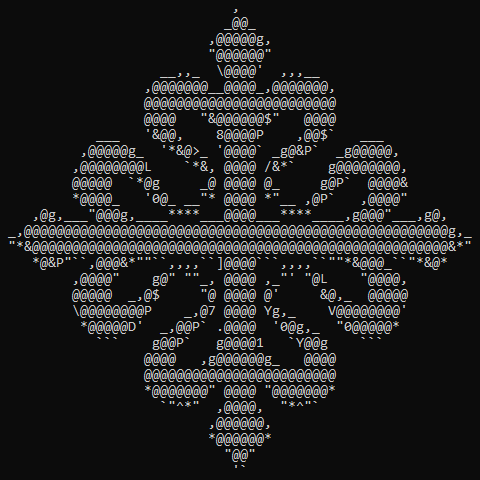
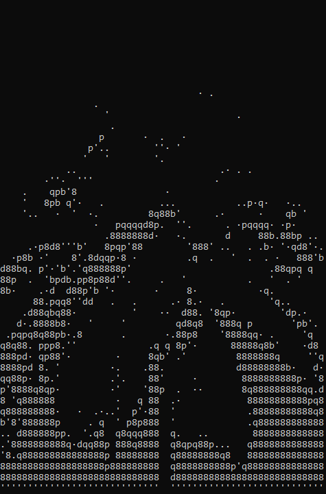

 
 

# Logo to ASCII

Prueba de concepto para convertir un logo en ASCII art (hecho en rust).

A diferencia de otros conversores de imágenes a ASCII, este no usa la luminosidad media de cada bloque, sino que elige el carácter que mejor se aproxima a su forma.

## Índice

- [Logo to ASCII](#logo-to-ascii)
  - [Índice](#índice)
  - [Instalación](#instalación)
  - [Tutorial](#tutorial)
    - [Logo simple](#logo-simple)
    - [Logo con colores](#logo-con-colores)
    - [Imagen con muchos detalles](#imagen-con-muchos-detalles)
  - [Consejos para crear imágenes](#consejos-para-crear-imágenes)
  - [¿Cómo funciona?](#cómo-funciona)
  - [Preguntas frecuentes](#preguntas-frecuentes)

## Instalación

1. Descarga rust desde https://www.rust-lang.org/tools/installs:
    1. Al terminar la instalación escribe `rustc --version` en la consola para comprobar que todo ha salido bien.
2. Descarga este repositorio.
3. Compila el repositorio: En la consola de comandos ejecuta `cargo build`.

## Tutorial

### Logo simple

El caso más básico consiste en tratar logos de un solo color. Usaremos la siguiente imagen:

Para convertirla, ejecutamos el programa desde la consola. Le indicamos la imagen con el argumento `--path <path_imagen>`.

`./target/debug/logo_to_ascii.exe --path <path_imagen>`

Ese comando imprimirá el texto en la consola. El set por defecto de caracteres es `8dbqp'·. ` (incluyendo el espacio).

`./target/debug/logo_to_ascii.exe --path ./images/Cross_Calatrava.png`

**Opciones:**

-   Para imprimir la imagen en negativo (imprimiendo donde está el color negro) se debe añadir `-i` al comando.

> [!IMPORTANT]
> Los píxeles transparentes nunca se imprimen. En este caso, la imagen tiene el fondo transparente, por lo que tenemos que añadir `-v` para imprimirlos.

`./target/debug/logo_to_ascii.exe --path ./images/Cross_Calatrava.png -iv`

-   Para cambiar el set de caracteres se usa el argumento `--chars <caracteres>`. El set de caracteres debe ir entre `"` o `'` si se quiere usar el espacio.
    Para usar los caracteres de las comillas (`"` y `'`) se deben hacer pruebas dependiendo de la consola que se use:

Linux

-   Se puede usar la barra invertida sin ningún problema: `--chars "chars'\""` usará `chars"'`.

Windows

-   Powershell: `--chars "chars' \"` usará `chars' "`. Siempre tiene que haber un espacio antes de `\`. Si no, tomará `\` como carácter.
-   CMD: `--chars "chars'\"` usará `chars'"`.

 

-   Para añadir caracteres al grupo por defecto se usa `-a <caracteres_a_añadir>`. Por ejemplo, `-a "_/\\"` añadirá los caracteres `_`, `/` y `\`.
-   Para usar todos los caracteres ASCII imprimibles por pantalla (del 32 al 126 incluidos) se debe añadir `--all`.

`./target/debug/logo_to_ascii.exe --path ./images/Cross_Calatrava --all`

-   Para cambiar la fuente con la que se hace la comparación se puede usar el argumento `--font <path_fuente>.ttf`.

> [!WARNING]
> Este argumento no adapta los bloques al tamaño de la fuente. Cada carácter se tomará como monoespacio de 8x16, lo que puede deformar el resultado final.

-   Para guardar el texto en un documento de texto se puede añadir `> <path_archivo>.txt` al final del comando.

### Logo con colores

Ahora vamos a probar con un logo de varios colores. Usaremos la siguiente imagen:

-   Para hacer una diferencia entre colores se usa el flag `-c`. Esto pondrá un borde negro donde detecte cambios de color. La anchura de los bordes se puede cambiar con el argumento `-b <anchura>`.

`./target/debug/Logo_to_ASCII.exe --path '.\images\tentacles.png' -cb8`

-   Si se usa `-b <anchura>` sin `-c` se detectarán los bordes midiendo la luminosidad. No es recomendable, porque algunos colores (como el amarillo) tienen una luminosidad muy parecida a la del blanco, por lo que no se detecta la diferencia.
-   Para cambiar la sensibilidad del detector de bordes se usa `-d <diferencia>`. Cuanto más alto sea el valor, más brusco tendrá que ser el cambio para que lo detecte.
-   Para pasar la imagen a blanco y negro se añade `-r`. Para cambiar el umbral se usa `-t <luminosidad_minima>`.

### Imagen con muchos detalles

Si estás pensando en pasar a ASCII una foto con muchos detalles, lo mejor es que dejes de hacerlo. Los caracteres ASCII no tienen suficiente detalle como para que se vea bien la foto. Lo mejor que se puede hacer es pasar la imagen a blanco y negro con `-r`.

Por ejemplo:

`./target/debug/Logo_to_ASCII.exe --path '.\images\palm.jpg' -r`

## Consejos para crear imágenes

Se recomienda hacer dibujos vectoriales (.svg) y luego pasarlos a imagen.

Para obtener los mejores resultados es recomendable que las imágenes tengan bordes bien definidos y pocos detalles, así como superficies amplias.
Para facilitar el diseño se pueden hacer dibujos vectoriales con una rejilla de 8x16 y asegurarse de que los bordes siempre coincidan con los bordes y esquinas de un bloque.

No se debe intentar meter más detalles más pequeños que uno de estos bloques.

## ¿Cómo funciona?

La idea surgió de un video en el que se convertía una imagen a ASCII. Sin embargo, se perdía mucha información y los caracteres no tenían la forma que debían.

Este algoritmo opera con píxeles en vez de con bloques.

1. Caracteres:

Primero se procesan los caracteres. En la consola tienen una proporción de 2 de alto por 1 de ancho. Se eligen las dimensiones 8x16 para hacer un mapa de bits de cada carácter, que indica la luminosidad de cada píxel.

Al calcular la luminosidad se obtiene un valor de 0 a 1. Es importante restarle 0.5 para obtener valores negativos y positivos.

2. Preprocesado (si lo hay)

Primero se detectan los bordes: un píxel se marca como borde si la diferencia entre su valor y el de los píxeles situados a su derecha y debajo es más grande que un valor preestablecido.

Estos bordes se pintan luego en la imagen.

Finalmente se pasa la imagen a blanco y negro en caso de que se haya seleccionado.

3. Convertir bloques a carácter

Después se procesa la imagen, dividiéndola en bloques de 8x16 (la misma medida que nuestros caracteres) y se calcula la luminosidad de cada uno de los píxeles (restándole también 0.5).

Por cada carácter, se multiplica el valor de cada píxel con su homólogo en el bloque, y se suman todos los valores ([0][0] * [0][0] + [0][1] * [0][1] + ...). Al final, se imprime el carácter con la puntuación más alta.

El algoritmo funciona porque al multiplicar dos valores positivos se obtiene un número positivo, y al multiplicar dos números negativos también. Esto premia las coincidencias de píxeles (y no píxeles) y penaliza las diferencias.

## Preguntas frecuentes

-   ¿Cómo imprimir un logo de color negro?
    Solo es un problema cuando el fondo es transparente. En ese caso basta con añadir `-i` al comando, para imprimir la imagen en negativo. Recordamos que el color transparente nunca se imprime.

-   ¿Por qué cuando cambio la fuente el texto se imprime con la misma fuente?
    La aplicación solo usa la fuente para comparar cada bloque de la imagen con los caracteres. Se deberá cambiar la fuente de la consola (o donde la quieras poner para que encaje). Es probable que se vea deformado, ya que la aplicación asume que es una fuente monoespacio de 8x16.
