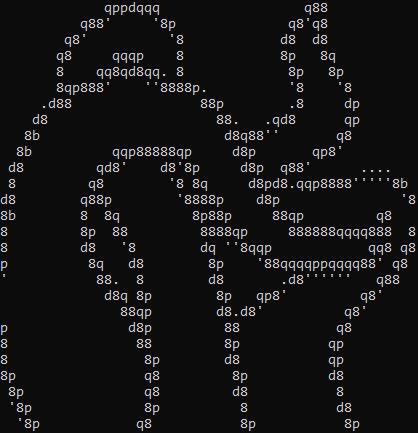

<div>
 
 
</div>

# Logo to ASCII

Aplicación que convierte un logo a ASCII art (hecho en rust).

A diferencia de otros conversores de imágenes a ASCII, este no usa la luminosidad media de cada bloque, sino que elige el carácter que mejor se aproxima a su forma.

Funciona mejor con imágenes de pocos colores y bordes bien definidos.

# Índice

- [Logo to ASCII](#logo-to-ascii)
- [Índice](#índice)
- [Instalación](#instalación)
- [Tutorial](#tutorial)
  - [Logo simple](#logo-simple)
  - [Logo con colores](#logo-con-colores)
  - [Imprimir colores](#imprimir-colores)
  - [Todo junto](#todo-junto)
  - [Imagen con muchos detalles](#imagen-con-muchos-detalles)
- [Consejos para crear imágenes](#consejos-para-crear-imágenes)
- [¿Cómo funciona?](#cómo-funciona)
- [Preguntas frecuentes](#preguntas-frecuentes)

# Instalación

-   Prerrequisitos:

    -   [Rust](https://www.rust-lang.org/tools/install)
    -   [Git](https://git-scm.com/downloads)

-   Pasos:

1. Descarga este repositorio con:
    ```
    git clone https://github.com/Jala3400/Logo_to_ASCII
    ```
2. Compila el repositorio: En la consola de comandos ejecuta
    ```
    cargo build --release
    ```

# Tutorial

## Logo simple

El caso más básico consiste en tratar logos de un solo color. Usaremos la siguiente imagen:


Para convertirla, ejecutamos el programa desde la consola. El primer argumento debe ser la ruta de la imagen.

```
./target/release/logo_to_ascii.exe ./images/Cross_Calatrava.png
```


-   Para imprimir la imagen en negativo se debe añadir `-n` al comando.

> [!IMPORTANT]
> Los píxeles transparentes nunca se imprimen. En este caso, la imagen tiene el fondo transparente, por lo que tenemos que añadir `-v` para imprimirlos.

```
./target/release/logo_to_ascii.exe ./images/Cross_Calatrava.png -nv
```


El set por defecto de caracteres es `8dbqp'·. ` (incluyendo el espacio).

-   Para cambiar el set de caracteres se usa el argumento `--chars <caracteres>`. El set de caracteres debe ir entre `"` o `'` si se quiere usar el espacio.
    Para usar los caracteres de las comillas (`"` y `'`) se deben hacer pruebas dependiendo de la consola que se use:

<details>
<summary>Linux</summary>

-   Se puede usar la barra invertida sin ningún problema: `--chars "chars'\""` usará `chars"'`.

</details>

<details>
<summary>Windows</summary>

-   Powershell: `--chars "chars' \"` usará `chars' "`. Siempre tiene que haber un espacio antes de `\`. Si no, tomará `\` como carácter.
-   CMD: `--chars "chars'\"` usará `chars'"`.

</details>
<br>

-   Para añadir caracteres al grupo por defecto se usa `-a <caracteres_a_añadir>`. Por ejemplo, `-a "_/\\"` añadirá los caracteres `_`, `/` y `\`.
-   Para usar todos los caracteres ASCII imprimibles por pantalla (del 32 al 126 incluidos) se debe añadir `--all`.
-   Para eliminar caracteres de ser usados, se puede usar `-x <caracteres_a_eliminar>`.

```
./target/release/logo_to_ascii.exe ./images/Cross_Calatrava.png --all
```


-   En caso de que se quiera cambiar el tamaño de la imagen, se usarán los argumentos `-w <anchura>` y `-h <altura>`. Estos indicarán el número de caracteres que habrá en horizontal o en vertical en el texto final. **Si se cambia solo uno de los argumentos se mantendrá la proporción de la imagen.**
-   Además están las opciones `--aw <anchura>` y `--ah <altura>` que te permiten cambiar el tamaño de la imagen en píxeles. De la misma forma, si solo se indica un argumento, se mantendrá la proporción de la imagen.
    Estos argumentos se pueden mezclar, pero tendrá más prioridad el tamaño en caracteres.
    En la consola los caracteres tienen una proporción de 1x2. El tamaño que se usa en esta aplicación es de 8x16.

```
./target/release/logo_to_ascii.exe ./images/Cross_Calatrava.png -w100
```


-   Si la imagen no queda bien alineada con los caracteres, se puede usar el argumento offset `--ofx <offset_x>` y `--ofy <offset_y>`. Estos valores añaden un offset transparente a la imagen. Se puede ver mejor en las esquinas afiladas.

```
./target/release/logo_to_ascii.exe .\images\Cross_Calatrava.png --ofx 4 --ofy 8
```


-   Para cambiar la fuente con la que se hace la comparación se puede usar el argumento `--font <path_fuente>.ttf`.

> [!WARNING]
> `--font` no adapta los bloques al tamaño de la fuente. Cada carácter se tomará como monoespacio de proporciones 1x2, lo que puede deformar el resultado final.

-   Para cambiar el punto medio de la luminosidad se usa `-m <punto_medio>`. Por defecto es 0.5. Se pone un valor más bajo se imprimirán colores más oscuros.
-   Para guardar el texto en un documento de texto se puede añadir `> <path_archivo>.txt` al final del comando.

## Logo con colores

Ahora vamos a probar con un logo de varios colores. Usaremos la siguiente imagen:


-   Para dibujar un borde entre los colores se usa el flag `-c`. Esto pondrá un borde negro donde detecte cambios de color. La anchura de los bordes se puede cambiar con el argumento `-b <anchura>`. Para cambiar la sensibilidad del detector de bordes se usa `-d <diferencia>`. Cuanto más alto sea el valor, más brusco tendrá que ser el cambio para que se detecte.

```
./target/release/Logo_to_ASCII.exe '.\images\tentacles.png' -c
```


-   Si se combina con `-n` y se tiene el fondo transparente solo se verán los bordes.

```
./target/release/Logo_to_ASCII.exe '.\images\tentacles.png' -cn
```



-   Para ver la imagen original en negativo, al igual que con el logo anterior, se debe añadir `-nv`

```
./target/release/Logo_to_ASCII.exe '.\images\tentacles.png' -cnv
```


-   Otra combinación interesante es `-cv`

```
./target/release/Logo_to_ASCII.exe .\images\tentacles.png -cv
```


-   Si se usa `-b <anchura>` sin `-c` se detectarán los bordes midiendo la luminosidad. No es recomendable, porque algunos colores (como el amarillo) tienen una luminosidad muy parecida a la del blanco, por lo que no se detecta la diferencia.
-   Para pasar la imagen a blanco y negro se añade `-r`. Para cambiar el umbral se usa `-t <luminosidad_minima>`.

## Imprimir colores

-   Para imprimir colores se usa el argumento `-C`.
-   Añadir `-s` saturará cada píxel al máximo (solo los que serían visibles).

Las imágenes situadas al inicio del documento son:

```
./target/release/Logo_to_ASCII.exe .\images\Cross_Calatrava.png -C
```


```
./target/release/Logo_to_ASCII.exe .\images\tentacles.png -cC
```


## Todo junto

-   Todos estos argumentos también se puede mezclar unos con otros

```
./target/release/Logo_to_ASCII.exe .\images\Cross_Calatrava.png -cCv
```


```
./target/release/Logo_to_ASCII.exe .\images\tentacles.png -cCv -a "@#$&Yg*'´_/\ \"
```


-   Antes de convertir la imagen a caracteres, la aplicación cambia la imagen. Para guardar la imagen final se usa `-o <nombre_imagen>`.

```
./target/release/Logo_to_ASCII.exe .\images\tentacles.png -cCv -o final_tentacles_cCv.png
```


## Imagen con muchos detalles

Si estás pensando en pasar a ASCII una foto con muchos detalles, lo mejor es que dejes de hacerlo.

Los caracteres ASCII no tienen suficiente detalle como para que se vea bien la foto. Esta aplicación está pensada para superficies amplias y bordes definidos.

Dicho esto, lo mejor que se puede hacer es cambiar el punto medio de la luminosidad (por ejemplo, a 0.7) con `-m 0.7` o pasar la imagen a blanco y negro con `-r` y cambiar el threshold a `-t 0.7`.

Por ejemplo:


```
./target/release/Logo_to_ASCII.exe .\images\palm.jpg -rt 0.7
```


Otra opción es añadir `-m 0` y `-C`, lo que imprimirá todos los caracteres con colores.

```
 ./target/release/Logo_to_ASCII.exe .\images\palm.jpg -m 0 -C
```


# Consejos para crear imágenes

La aplicación dibuja con caracteres. Estos no tienen capacidad para mostrar detalles, pero tienen forma.

No se recomienda tener detalles más pequeños que uno de estos bloques, a no ser que la forma coincida con la de un carácter en específico.

Haz dibujos vectoriales (.svg) y luego convertirlos a imagen.
Dibuja bordes definidos y superficies amplias.

Para facilitar el diseño se puede usar una rejilla de 8x16 y asegurarse de que los bordes del dibujo siempre coincidan con los bordes y esquinas de un bloque.

# ¿Cómo funciona?

La idea surgió de un video en el que se convertía una imagen a ASCII. Sin embargo, se perdía mucha información y los caracteres no tenían la forma que debían.

Este algoritmo opera con píxeles en vez de con bloques.

1. **Caracteres:**

Primero se procesan los caracteres. En la consola tienen una proporción de 2 de alto por 1 de ancho. Una vez elegido un tamaño (por defecto 8x16) se hace un mapa de bits de cada carácter, que contiene la luminosidad de cada píxel.

Al calcular la luminosidad se obtiene un valor de 0 a 1. Es importante restarle 0.5 para obtener valores negativos y positivos.

Además, se cuentan el número de píxeles con luminosidad positiva para una optimización futura.

Hay varias operaciones que permiten cambiar los caracteres:

-   `--chars <caracteres>`: Cambia el set de caracteres por defecto. Se pueden usar comillas simples o dobles para incluir espacios.
-   `--all`: Cambia el set por defecto a todos los caracteres ASCII imprimibles (con prioridad sobre chars).
-   `-a <caracteres>`: Añade caracteres al set por defecto.
-   `-x <caracteres>`: Elimina caracteres del set por defecto.
-   `--font <path_fuente>.ttf`: Cambia la fuente con la que se comparan los caracteres.

2. **Preprocesado (si lo hay)**

Para no tener que crear las imágenes a la perfección, la aplicación permite hacer ciertas operaciones. Son, en orden de ejecución:

-   Cambiar el tamaño de la imagen:

    -   `-w <caracteres_anchura>`: Anchura en caracteres
    -   `-h <caracteres_altura>`: Altura en caracteres
    -   `--aw <anchura>`: Anchura en píxeles
    -   `--ah <altura>`: Altura en píxeles

-   Añadir offset a la imagen:

    -   `--ofx <offset_x>`: Offset in x
    -   `--ofy <offset_y>`: Offset in y

-   Saturar cada uno de los píxeles: `-s`
-   Dibujar bordes entre colores:

    -   `-b <anchura_borde>`: Anchura de los bordes. Si se da sin `-c` se calculan los bordes por luminosidad.
    -   `-c`: Calcula los bordes por color. Si no se da `-b` se pone por defecto a 8.
    -   `-d <diferencia_minima>`: Diferencia mínima para detectar un borde.

-   Hacer el negativo de la imagen (invertir la luminosidad): `-n`

-   Ver pixeles transparentes: `-v`
-   Pasar la imagen a blanco y negro:

    -   `-r`: Pasa la imagen a blanco y negro.
    -   `-t <threshold>`: Valor mínimo para que un pixel se pase a blanco.

3. **Convertir bloques a carácter**

Después se divide la imagen en bloques con las mismas medidas que los caracteres. Cada bloque se compara con todos los caracteres (se pueden saltar varios en ciertos casos, ver optimización).

Por cada carácter, se multiplica la luminosidad de cada píxel con su homólogo en el bloque, y se suman todos los valores ([0][0] \* [0][0] + [0][1] \* [0][1] + ... + [n][m] \* [n][m]). Al final, se imprime el carácter con la puntuación más alta.

En este apartado se da la opción de cambiar el punto medio en la luminosidad con `-m <punto_medio>`. Este argumento es por defecto 0.5 e indica lo que se le resta a la luminosidad de cada pixel (que está entre 0 y 1).

**Optimización:**

En este paso también se cuentan el número de píxeles iluminados del bloque. Un carácter solo se considera para impresión si la mitad de sus píxeles con luminosidad positiva son al menos el número de los píxeles iluminados del bloque.

La frase es complicada de entender, pero, en resumen, si un carácter tiene 10 píxeles con luminosidad > 0, un carácter solo se considerará si tiene al menos 5 píxeles iluminados. Si tuviera menos de 5, no habría escenario en el que ese carácter se eligiera antes que el espacio. En caso de no haber espacio, se elige el carácter con menos píxeles iluminados.

Además, si todos los píxeles están completamente iluminados se puede imprimir directamente el carácter más luminoso.

El algoritmo funciona porque al multiplicar dos valores positivos se obtiene un número positivo, y al multiplicar dos números negativos también. Esto premia las coincidencias de píxeles (y no píxeles) y penaliza las diferencias.

# Preguntas frecuentes

-   **¿Cómo imprimir un logo de color negro?**
    Solo es un problema cuando el fondo es transparente. En ese caso basta con añadir `-n` al comando, para imprimir la imagen en negativo. Recordamos que los pixeles transparentes nunca se imprimen.

-   **¿Por qué cuando cambio la fuente el texto se imprime con la misma fuente?**
    La aplicación solo usa la fuente para comparar cada bloque de la imagen con los caracteres. Se deberá cambiar la fuente de la consola (o donde la quieras poner para que encaje). Es probable que se vea deformado, ya que la aplicación asume que es una fuente monoespacio con proporción 1x2.

-   **No lee algunos de los argumentos**
    En algunos casos, al añadir caracteres (por lo menos en la powershell de windows 10), si se acaba en ` \"` (para añadir el carácter `"`) lo que se ponga después se tomará como caracteres a añadir. La solución es poner los argumentos antes que el argumento de los caracteres.
